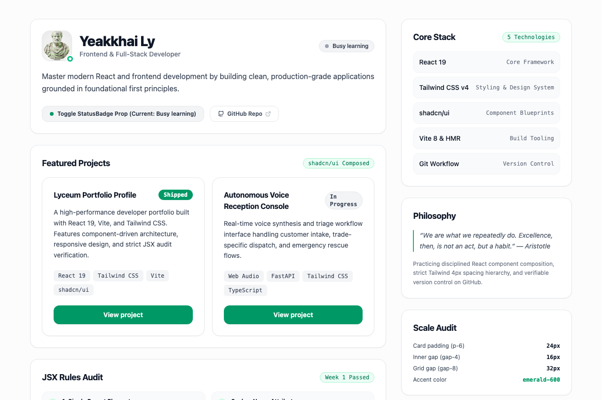
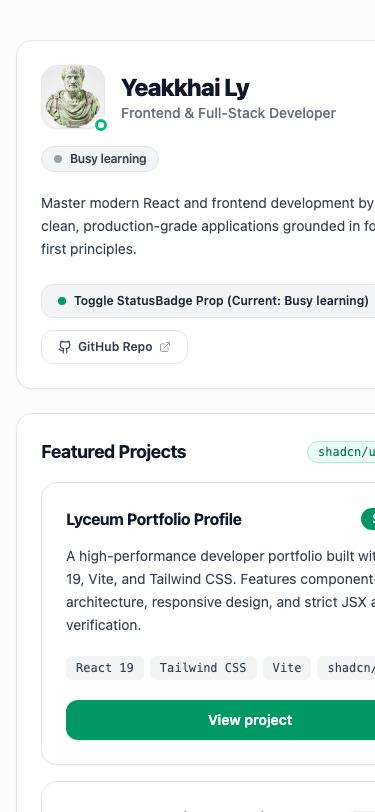
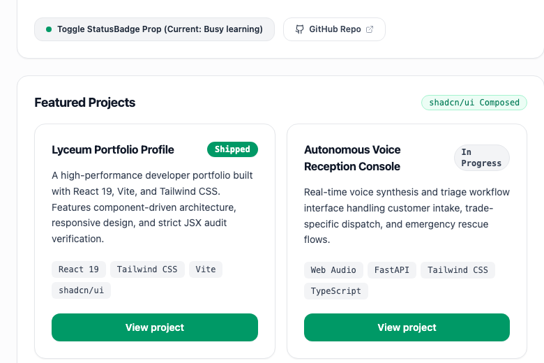

# Developer Portfolio - Week 1: Profile Page

A modern developer profile page built from scratch with **Vite**, **React 19**, and **Tailwind CSS v4** to practice core JSX rules, component hierarchy, and professional Git workflows.

## 📱 Responsive Preview (Desktop & Mobile Side-by-Side)

<table>
  <tr>
    <td width="65%" align="center"><strong>Desktop View (2-Column Layout)</strong></td>
    <td width="35%" align="center"><strong>Mobile View (Single Column)</strong></td>
  </tr>
  <tr>
    <td></td>
    <td></td>
  </tr>
</table>

### 🧩 shadcn/ui Project Cards (Rendered with Distinct Data)



---

## 🎯 The Mission & Objectives

- **Restyle with Tailwind CSS v4 only:** Strict adherence to the 4px spacing scale (`p-6`, `gap-4`, `space-y-6`, `py-10`), `text-gray-900/700/500` typographic hierarchy, and one single accent color (`emerald-600`).
- **Responsive Architecture:** Single column on mobile devices, 2-column layout (main 8-col + sidebar 4-col) from `md:` breakpoint up, with smooth hover and transition states.
- **Component Extraction:**
  - `SkillBadge.jsx`: Takes `{ name, category }` props, rendering different content per instance.
  - `SectionCard.jsx`: Reusable container taking `{ title, badge, children }` rendering unquoted `{children}`.
- **shadcn/ui Composition:**
  - `ProjectCard.jsx`: Composed from `Card` + `Badge` + `Button` blueprints imported from `@/components/ui/*`.
  - Rendered twice with distinct project datasets.

---

## 🛠️ Tech Stack

- **Framework:** React 19
- **Build Tool:** Vite 8 (with `@` path alias support)
- **Styling:** Tailwind CSS v4 (`@tailwindcss/vite`)
- **UI Components:** shadcn/ui blueprints (`Card`, `Badge`, `Button`, `cva`, `clsx`, `tailwind-merge`)
- **Icons:** Lucide React
- **Linter:** Oxlint
- **Version Control:** Git & GitHub

---

## 📂 Project Structure

```text
week-1/
├── index.html
├── package.json
├── vite.config.js               # Path alias '@' configured to ./src
├── jsconfig.json
├── README.md
├── screenshot-desktop.png       # Desktop 2-column screenshot
├── screenshot-mobile.png        # Mobile single-column screenshot
├── screenshot-projects.png      # ProjectCards screenshot
└── src/
    ├── main.jsx
    ├── index.css                # Tailwind CSS v4 import
    ├── App.jsx                  # Responsive 2-column layout
    ├── lib/
    │   └── utils.js             # cn() utility
    └── components/
        ├── ProjectCard.jsx      # Composed shadcn Card + Badge + Button
        ├── SectionCard.jsx      # Reusable section with {children}
        ├── SkillBadge.jsx       # Reusable props-driven badge
        ├── StatusBadge.jsx      # Reusable status badge with ternary logic
        └── ui/
            ├── badge.jsx        # shadcn Badge blueprint
            ├── button.jsx       # shadcn Button blueprint
            └── card.jsx         # shadcn Card compound primitives
```

---

## 🚀 Getting Started

### Prerequisites

- Node.js (v18+ recommended, tested on Node v22.x)
- npm

### Installation

Clone the repository and install dependencies:

```bash
git clone git@github.com:lyyeakkhai/my-portfolio.git
cd my-portfolio
npm install
```

### Running the Dev Server

Start Vite's fast development server with Hot Module Replacement (HMR):

```bash
npm run dev
```

Open [http://localhost:5173](http://localhost:5173) in your browser.

### Building for Production

Compile and bundle the project for production:

```bash
npm run build
```

The optimized assets will be emitted to the `dist/` directory.

### Linting

Run Oxlint to verify code quality:

```bash
npm run lint
```

---

## 🌿 Git Workflow Used

This project followed the required branch-and-merge developer workflow:

1. **Scaffold & Baseline on `main`:**
   ```bash
   git init
   git checkout -b main
   git add .
   git commit -m "chore: scaffold vite react project with tailwind css"
   ```

2. **Feature Development on `profile-v1`:**
   ```bash
   git checkout -b profile-v1
   # Implemented StatusBadge and Profile page
   git add .
   git commit -m "feat: implement profile page with JSX rules compliance"
   git push -u origin profile-v1
   ```

3. **Clean Merge into `main`:**
   ```bash
   git checkout main
   git merge profile-v1 --no-edit
   git push origin main
   ```

---

## 👤 Author

- **Yeakkhai Ly**
- GitHub: [@lyyeakkhai](https://github.com/lyyeakkhai)
- Repository: [my-portfolio](https://github.com/lyyeakkhai/my-portfolio)
